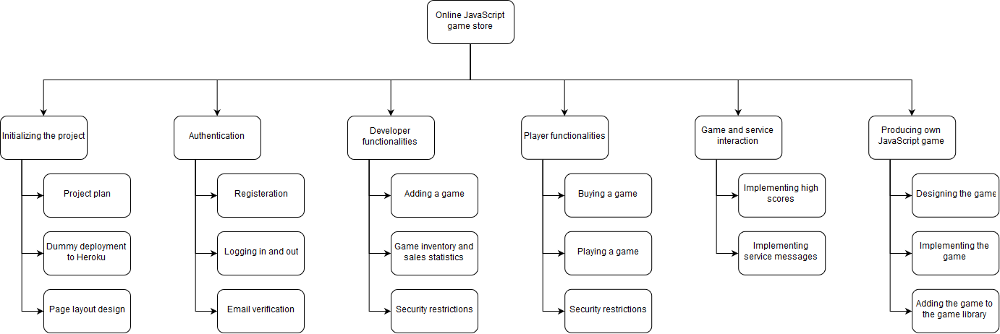
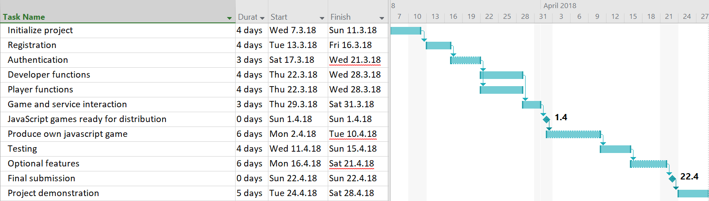
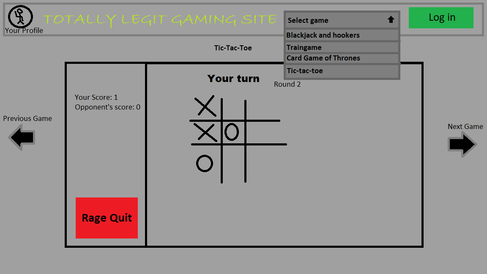

| **Version** | **Date** | **Update date** | **Updater** |
| --- | --- | --- | --- |
| 0.1 | Gantt chart and work break down structure | 7.3.2018 | J. Gustafsson |
| 0.2 | Extra features and project management added | 13.3.2018 | All |
| 0.3 | Added example image of site view | 13.3.2018 | A. Antikainen |
| 0.4 | Added site url | 20.3.2018 | A. Vaarala |
|   |   |   |   |

Table of contents

1.        Introduction        

2.        Listed features        

3.        Project plan        

4.        Site Layout    

5.		  Site Url    

# 1. Introduction

The aim of the project is to create a web page and back-end for a JavaScript store. The store is aimed for players as well as game developers who want to sell their games. Project is managed with Windows Project, a project and resource tool and the plan will be updated regularly. Project team meets each week on Tuesdays at 16.00. There is no project manager but the tasks are divided and everyone is responsible for the deadlines.

# 2. Listed features

Plan is to implement only the mandatory features and the most useful functionalities such as third-party login and testing the service with other groups&#39; games. The extra features are planned and implemented at the end of the project after the mandatory features have been implemented.

# 3. Project plan

 

The project begins on 7th of March and will end on the 24th of May when the final product has been presented. To manage the time lines and tasks easier a work breakdown structure has been implemented (figure 1).

Figure 1. Work breakdown structure

Based on the time frame given a project schedule has been done by using a Gantt chart (figure 2). The Gantt chart only shows the deadlines of the major tasks because the smaller tasks are divided between the project team members depending on their personal schedules.

 

Figure 2. Project schedule

# 4. Site Layout

 

Image 1: Simple example of site view

# 5. Site Url

	http://intense-temple-48778.herokuapp.com